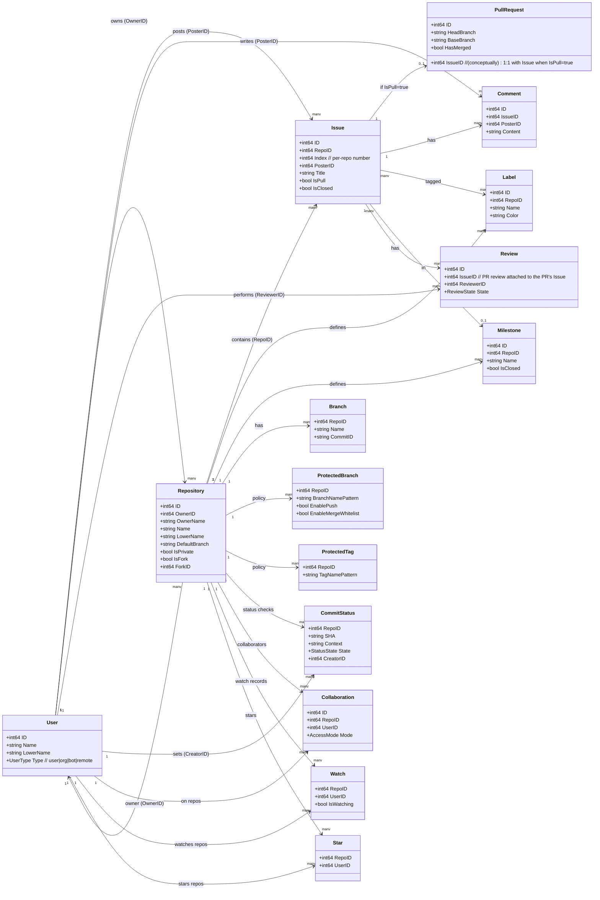
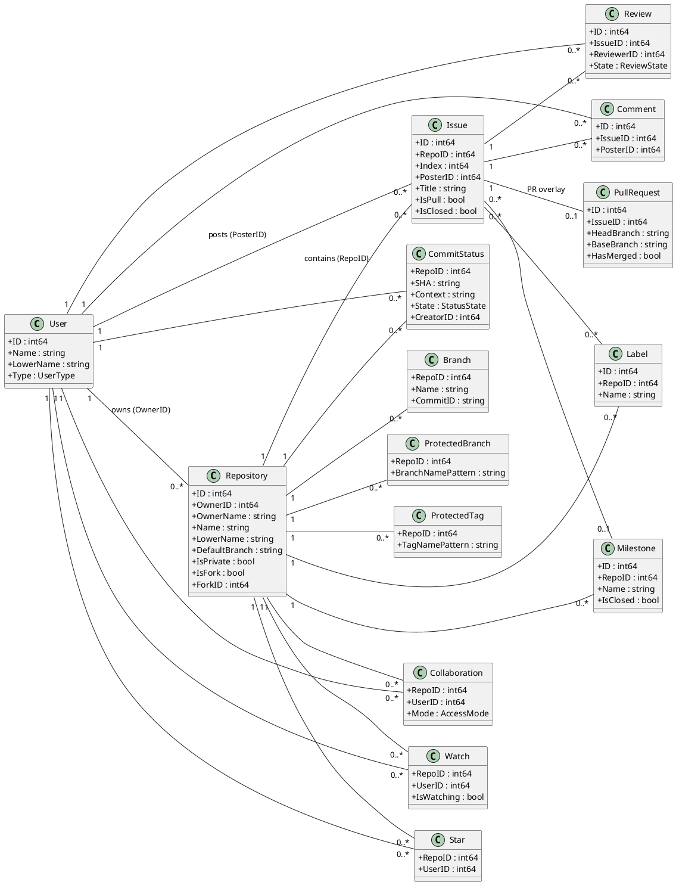

# Gitea Models Overview (High Level)

This is a high-level map of the model areas under:

- `context/gitea/models`

It is meant as a quick reference when porting or re-modeling server-side logic into `gitcoda` (domain/models/services) while keeping the Leptos UI in `gitcoda_web`.

## Model Areas (Broad)

Gitea's models are organized mostly by domain subpackages. The main "anchor" entities you tend to care about first:

- `models/user`: `User` (accounts; also used as the backing row for orgs)
- `models/repo`: `Repository` and repository-adjacent tables (units/features, stars/watches, collaborators, releases, wiki, mirrors, uploads/attachments, etc.)
- `models/issues`: `Issue` and `PullRequest` (PR is an issue with extra PR-specific state), plus comments/labels/milestones/reviews/reactions/time tracking
- `models/git`: git-adjacent database state like branches, protected branches/tags, commit statuses (also contains LFS, but you can ignore that if not needed)

Other high-level buckets you'll run into as you expand server-side logic:

- `models/organization`: orgs + teams (org is essentially a `User` with `Type=org`)
- `models/auth` + `models/asymkey`: access tokens, OAuth apps, sessions, 2FA, WebAuthn, SSH keys, deploy keys, GPG keys
- `models/webhook`: webhooks + delivery tasks
- `models/actions`: "Actions" runs/jobs/runners/schedules/artifacts/variables
- `models/packages`: package registry (container/debian/rpm/nuget/etc.)
- `models/activities`: activity actions + notifications + user heatmap/statistics
- plumbing/infrastructure: `models/db`, `models/migrations`, `models/perm`, `models/system`, `models/secret`, `models/unittest`, `models/fixtures`

## Repository-Centric View (Repo + Git-Facing + Issues/PRs)

The repository is the hub. The most common linkage patterns:

- `Repository.OwnerID` points to `User.ID` (repo owner can be a user or an org)
- `Issue.RepoID` points to `Repository.ID`
- `Issue.PosterID` points to `User.ID` (author)
- A pull request is an `Issue` with `Issue.IsPull=true`, with additional PR-only state in `PullRequest`
- Git-facing policy/state is repo-scoped: branches, protected branches/tags, commit statuses typically carry `RepoID`
- Many "user signals" and "access" things are join tables keyed by `(RepoID, UserID)` (stars, watches, collaboration, etc.)

## Diagram (Mermaid)

Paste the following into the Mermaid Live Editor to render:

- https://mermaid.live

## Diagram (PlantUML)

Paste the following into PlantText to render:

- https://www.planttext.com/

